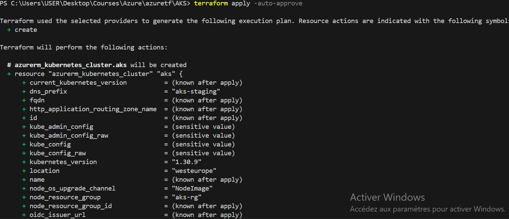
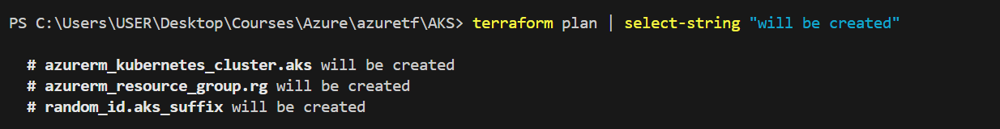
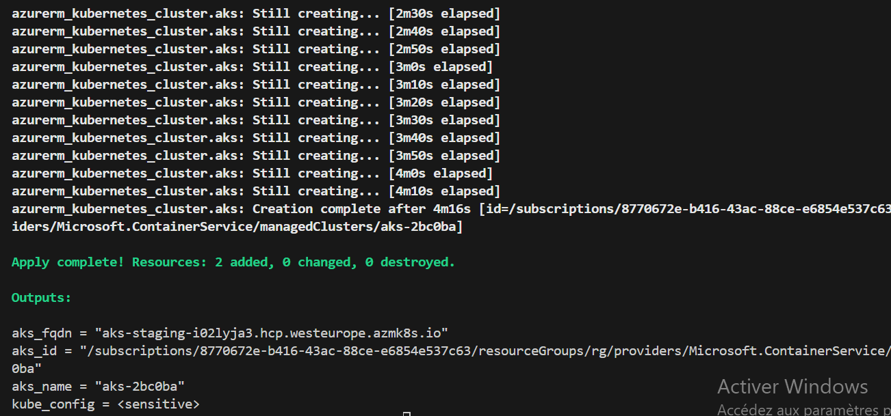
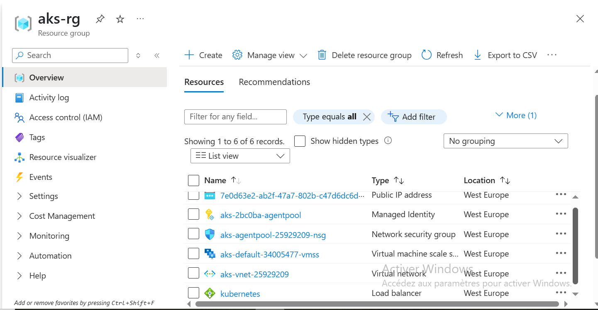
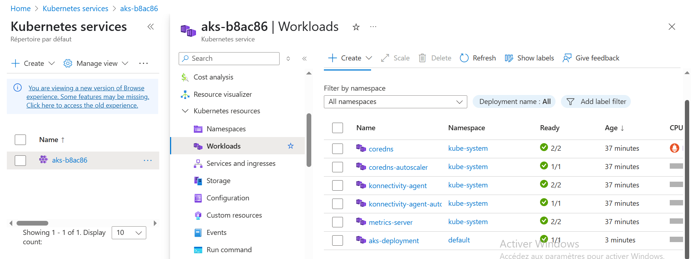
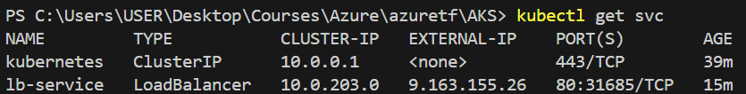
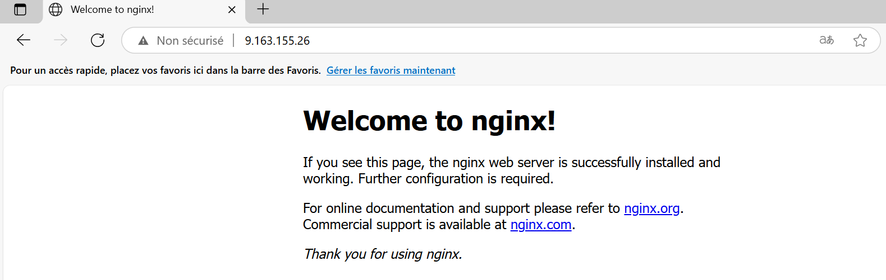

# Création d'un cluster AKS avec Terraform
## Description
Ce step-by-step met en place un cluster Kubernetes (**AKS** - *Azure Kubernetes Service*) via Terraform. Il inclut également le déploiement d’un service web simple basé sur NGINX, afin de valider le bon fonctionnement du cluster après son provisionnement.
## Technologies utilisées
- Terraform (Infrastructure as Code)
- Microsoft Azure
- Azure Kubernetes Service (AKS)
- Kubernetes (deployment + service)
- NGINX
## Objectifs
- Automatiser la création d’un cluster AKS avec des paramètres dynamiques
- Utiliser une architecture structurée pour faciliter la réutilisation et la maintenance
- Tester le bon fonctionnement du cluster avec le déploiement d’une image NGINX
- Intégrer la surveillance via Azure Monitor / Log Analytics
## Fonctionnalités principales
- Création d’un Resource Group Azure
- Génération d’un nom unique pour le cluster via `random_id`
- Cluster AKS :
   *  Pool de nœuds configuré
   *  Mise à l’échelle automatique activée (auto-scaling)
   *  Gestion réseau avec Azure CNI et Azure Network Policy
- Surveillance & observabilité :

   * Intégration via OMS Agent (remplacé en production par Azure Monitor Agent)   
- Déploiement applicatif :


       ```yaml

       apiVersion: apps/v1
       kind: Deployment
       metadata:
         name: aks-deployment
       spec:
         replicas: 1
         selector:
           matchLabels:
             app: hello-world
         template:
           metadata:
             labels:
               app: hello-world
           spec:
             containers:
             - name: hello
               image: nginx   
               ports:
               - containerPort: 80
       ---

       apiVersion: v1
       kind: Service
       metadata:
         name: lb-service
       spec:
         selector:
           app: hello-world
         ports:
         - protocol: TCP
           port: 80
           targetPort: 80
         type: LoadBalancer         
## Déploiement
**Prérequis**
- Azure CLI configuré et connecté
- Terraform installé (>= 1.11)
- Subscription Azure valide

**Étapes**


      

      git clone https://github.com/ISSA-AZTF/terraform-azdeploy-aks.git

      terraform init
      terraform plan 
      terraform apply -auto-approve

   

**Pour tester le cluster :**    


      az aks get-credentials --resource-group "rg" --name "aks-${random_id}"

      kubectl get nodes 
      kubectl apply -f deployment.yaml
      kubectl apply -f service.yaml
      kubectl get svc lb-service  

## 📸 Captures d’écran

### 1- Terraform Plan – Aperçu


### 2- Terraform Apply – Résultat


### 3- AKS – Node Resource Group


### 4- AKS – Workload NGINX



### 5- NGINX – Service LoadBalancer


### 6- NGINX – Test Navigateur

## Suppression des ressources

        terraform destroy
## Ressources utiles
- [Terraform Azure Provider Documentation](https://registry.terraform.io/providers/hashicorp/azurerm/latest/docs)
- [Azure Kubernetes Service (AKS) Overview](https://learn.microsoft.com/en-us/azure/aks/)
- [Terraform Functions](https://developer.hashicorp.com/terraform/language/functions) 