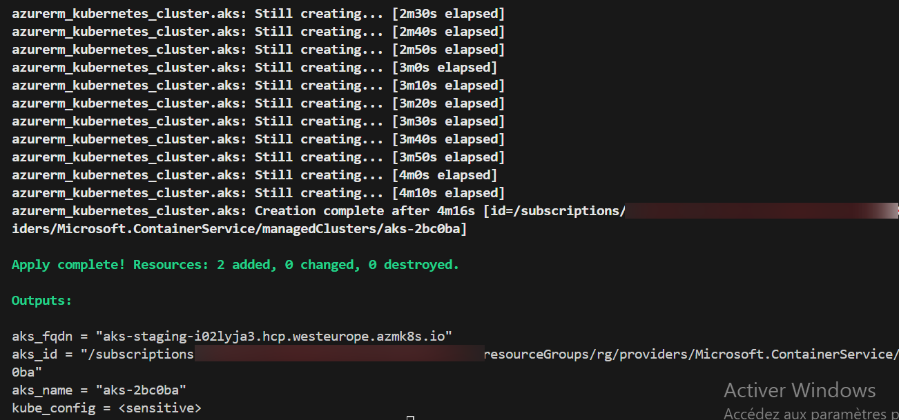
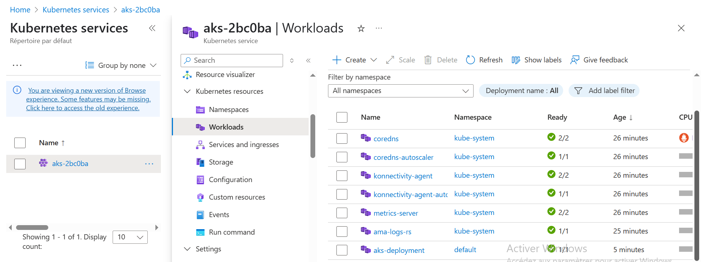

# Création d'un cluster AKS avec Terraform
## Description
Ce step-by-step met en place un cluster Kubernetes (**AKS** - *Azure Kubernetes Service*) via Terraform. Il inclut également le déploiement d’un service web simple basé sur NGINX, afin de valider le bon fonctionnement du cluster après son provisionnement.
## Technologies utilisées
- Terraform (Infrastructure as Code)
- Microsoft Azure
- Azure Kubernetes Service (AKS)
- Kubernetes (deployment + service)
- NGINX
## Objectifs
- Automatiser la création d’un cluster AKS avec des paramètres dynamiques
- Utiliser une architecture structurée pour faciliter la réutilisation et la maintenance
- Tester le bon fonctionnement du cluster avec le déploiement d’une image NGINX
- Intégrer la surveillance via Azure Monitor / Log Analytics
## Fonctionnalités principales
- Création d’un Resource Group Azure
- Génération d’un nom unique pour le cluster via random_id
- Cluster AKS :
   *  Pool de nœuds configuré
   *  Mise à l’échelle automatique activée (auto-scaling)
   *  Gestion réseau avec Azure CNI et Azure Network Policy
- Surveillance & observabilité :

   * Intégration via OMS Agent (remplacé en production par Azure Monitor Agent)   
- Déploiement applicatif :

   * Pod + Service NGINX déployés pour validation du cluster
## Déploiement
**Prérequis**
- Azure CLI configuré et connecté
- Terraform installé (>= 1.11)
- Subscription Azure valide

**Étapes**

    - Cloner le repo github localement 
         git clone https://github.com/ISSA-AZTF/tf-aks.git
         
    - Initialiser le projet 
         terraform init

    - Vérifier la syntaxe 
         terraform validate

    - Lancer le plan d'exécution 
         terraform plan 

    - Création des ressources 
         terraform apply -auto-approve
**Pour tester le cluster :**    

     - Se connecter au cluster
          az aks get-credentials --resource-group "rg" --name "aks-${random_id}"

     - Vérifier les nœuds du cluster
          kubectl get nodes 

     - Déployer l'application NGINX
          kubectl apply -f deployment.yaml

     - Déployer le service LoadBalancer exposant l'app NGINX
          kubectl apply -f service.yaml

     - Récupérer l'adresse IP du service pour y accéder via navigateur
          kubectl get svc lb-service  
## Ce que j’ai appris
- Automatisation complète d’un environnement AKS production-ready
- Utilisation de blocs dynamiques (dynamic, random_id, data source)  
- Transition OMS/MMA vers Azure Monitor Agent (AMA) et son impact sur la supervision AKS
- Intégration de Log Analytics et de l’observabilité sur Azure
- Déploiement Kubernetes basique pour validation du cluster
## 📸 Captures d’écran

### 1- Terraform Plan – Aperçu

### 2- Terraform Apply – Résultat

### 3- AKS – Node Resource Group

### 4- AKS – Workload NGINX

### 5- NGINX – Service LoadBalancer

### 6- NGINX – Test Navigateur

## Suppression des ressources

        terraform destroy
## Ressources utiles
- [Terraform Azure Provider Documentation](https://registry.terraform.io/providers/hashicorp/azurerm/latest/docs)
- [Azure Kubernetes Service (AKS) Overview](https://learn.microsoft.com/en-us/azure/aks/)
- [Terraform Functions](https://developer.hashicorp.com/terraform/language/functions) 